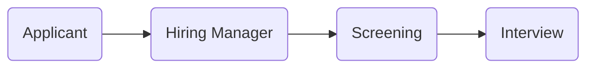
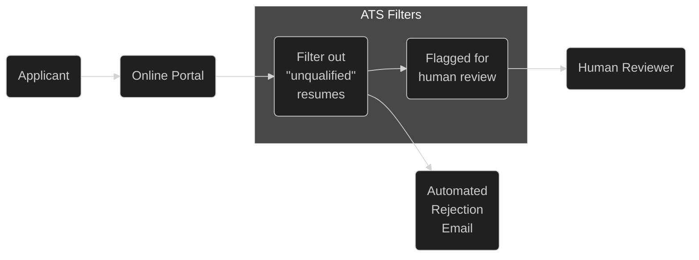
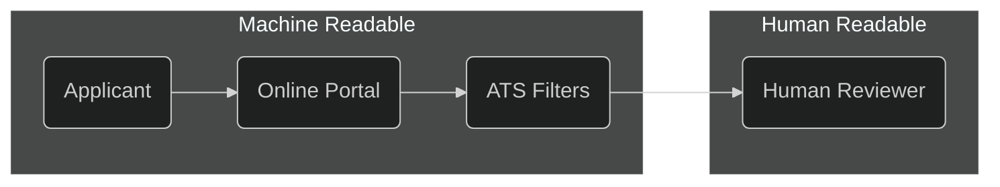

## Purpose
This brain dump was created by Fran for those in need of a resume overhaul. This will always be a work in progress as ATS changes and will be updated as I learn more; however, it has been consistent in getting me interviews to job offers and I hope it helps you too!

## Key Ideas
This is a rough outline of what I will be covering. I will be updating this as I go along as well.

1. [Why My Resume Sucked (and probably yours too)](#why-my-resume-sucked-and-probably-yours-too)
  - [Applicant Tracking Systems (ATS)](#applicant-tracking-systems-ats)
  - [Why is this happening?](#why-is-this-happening)
  - [What's Submitted vs What's Shown](#whats-submitted-vs-whats-shown)
2. [How to Make Your Resume Better](#how-to-make-your-resume-better)
  - [NEVER, ever ever ever ever use a non-LaTeX generated PDF](#never-ever-ever-ever-ever-use-a-non-latex-generated-pdf)
3. [My Resume Transformation and Results](#my-resume-transformation-and-results)
4. [How to Make Your Resume Even Better](#how-to-make-your-resume-even-better)
  - [Paragraphs vs Bulletpoints](#paragraphs-vs-bulletpoints)
  - [Categorize Your Skills](#categorize-your-skills)
  - [Remove specific dates](#remove-specific-dates)
  - [Experiment until it's good enough](#experiment-until-its-good-enough)
5. [Conclusion](#conclusion)


## Why My Resume Sucked (and probably yours too)
HUGE assumption: I'm gonna assume your resume is already written in PEE (Point, Example, Explain) and you have skills to prove it, but I'll show why your format is not getting you interviews.

### Applicant Tracking Systems (ATS)
It's no secret that any industry and any job will have a lot of applicants. It's also no secret that recruiters and hiring managers don't have time to read every single resume. So, they use ATS to filter out resumes that don't meet their criteria.

### Why is this happening?
This is my understanding of why. This is a change towards people wanting to be more data-driven and evidence-based. In order to do that, the process has to be automated to a certain extent. This is also a change towards people wanting to be more objective and less subjective (more on this later). This is also a change towards people wanting to be more efficient and less wasteful.

### Arbitrary Time Before 
Arbitrary time before, the superficial aspects of things had to look good. I recall even during my primary school education, the counselors who help with resumes drilled that resumes had to "look good" with font sizes for better readability and serif fonts for the interviewer to read from. So the process would look something like this: (1) Applicant submits resume, (2) Hiring manager reads resume, (3) Hiring manager decides to interview or not.



### Arbitrary Time After
Skip forward a few years/decades and now we have ATS that automated the screening--partially eliminating the need for human readable resume format. It's already been like this for awhile, but your resume has to be both machine-readable and human readable.



Some might say it's a good thing, some might say it's a bad thing. I'm not here to debate that. I'm here to help you get your resume to human eyes and this is the simplified process: (1) Resume has to first pass the machine filter, (2) Resume then makes it to the human filter. This is also why you might get an automated rejection email within a few hours of submitting your resume (although it's delayed on purpose to appear not automated).



### Why good applicants can get rejected
Companies hiring understand and are willing to take the risk of losing good applicants with bad resumes. Assuming the engineers are about the same in competency, the engineer with a resume that can be ATS-parsable will get the interview. The engineer with a resume that can't be ATS-parsable will not get the interview. This is why good applicants can get rejected sometimes.

### What's Submitted vs What's Shown
To make matters more complicated, companies use platforms like Lever, BambooHR, Workday, or even an in-house platform for job applications and it doesn't always show the parsed result. Sometimes you are lucky to edit the parsed entries, but not always. I couldn't find the original repo, but a few years ago when I initially encountered this problem, I found a public repo of one of the HR companies. The parsing function did not account for multiple bulletpoints for description. Meaning, even if you had the right keywords, your resume would not make it to the auto-filter if you unfortunately placed the keywords on your second or later bulletpoints. I'm not sure if it's still the same, but I'm sure it's not much better.

{: width="400" }

This is a Workday example where you can autofill with your resume and edit the parsed entries to check for errors, but how many applications have been submitted where you can't see what is actually parsed?

{: width="400" }

The "Role Description" is where the ATS will parse the keywords from. If you have multiple bulletpoints, the ATS will not parse the keywords from the second bulletpoint. This is why you should use paragraphs instead of bulletpoints. I'll elaborate later.

## How to Make Your Resume Better
So how do we fix that? Most important is the `source of your resume`. If you are using a template from Google Docs, Word, or any other non-LaTeX source, you are doing it wrong. Use a LaTeX template. I'll elaborate later.

### NEVER, ever ever ever ever use a non-LaTeX generated PDF
Always use a LaTeX converted PDF. ATS don't parse PDFs generated from other file extensions very well (Google Docs, Word Docs, etc). Use something like [Overleaf](https://overleaf.com) to create a LaTeX resume. In particular, I've used [moderncv package](https://ctan.org/pkg/moderncv?lang=en) and it seems to work the best in terms of getting the elements to align with what most ATS are looking for.

If you know anything about HTML, you know that a `<p>` tag and `<h1>` tag are not the same. They are both text, but they mean different things. The same goes for PDFs. A PDF generated from a LaTeX file is different from a PDF generated from a Word Doc.
```
# resume in PDF from Word
<list>
  <item>Software Engineer</item>
  <item>Company</item>
  <item>2019 - Present</item>
</list>

# resume in PDF from LaTeX
<experience>
  <title>Software Engineer</title>
  <company>Company</company>
  <date>2019 - Present</date>
</experience>
```

> Q: Which one do you think will be mapped to the ATS keywords better?

> A: The resume in LaTeX will be mapped better because the ATS can parse the elements better.

## My Resume Transformation and Results
This is an example from 2021 to show my colleagues/friends who asked for my help with their resumes. I submitted exactly the same resume content, but one that was converted from a Google Docs into PDF. I was rejected within hours of applying...

{: width="500" }

After submitting the same resume content, but one that was converted from my LaTeX file. I heard back from a recruiter within 3 business days of applying to the exact same role:

{: width="500" }

## How to Make Your Resume Even Better

With my example above, I didn't stop iterating on my format. I continued to iterate and make changes. Assuming that you are using a LaTeX template, here are some tips to make your resume even better.

### Paragraphs vs Bulletpoints
This was the quickest one I had to realize, because keywords are matched on what can be parsed and mapped to a specific experience. If they can't get to the core body of text, the keywords will not be matched.

```
# resume in bullet points
Software Engineer, Company, 2019 - Present
  - Built a web application
  - Used React, Node, and Express
  - Deployed on AWS

# resume in paragraph
Software Engineer, Company, 2019 - Present
  - Built a web application using React, Node, and Express and deployed on AWS.
```

### Categorize Your Skills
This is complete opposite to the advice of using paragraphs over multiple items, but the parsing function for skills section is different from the parsing function for experience section. Knowing the subtle difference is the key to getting your resume to human eyes. For example, create a category of "Providers" if you want to list "AWS, Azure, GCP, etc" and another category for "Visualization" if you want to list "PowerBI, Looker, Kibana".

```
# skill section
Skills
  - Python, Java, C++, AWS, Azure, GCP, PowerBI, Looker, Kibana

# skill section in paragraph
Skills
  - Providers: AWS, Azure, GCP
  - Visualization: PowerBI, Looker, Kibana
  - IaC: Terraform (terragrunt), CloudFormation, ARM 
```

### Remove specific dates
The date fields also get messed up during import so just the month and year is sufficient until you get to the interview where you can elaborate more (e.g., 10/02/2021 parsed as Feb 10th when you meant Oct 2nd and then it's flagged as fraudulent profile on the ATS system when cross-referenced with LinkedIn).

```
# resume with specific dates
Software Engineer, Company (10/02/2019 - Present)

# resume with month, year only
Software Engineer, Company (10/2019 - Present)
```

### Experiment until it's good enough
There are ATS evaluator websites. Get it to an acceptable rate of machine readability. Apply to an actual job and see how the fields are parsed. If it's not good enough, go back to iterate.

## Conclusion
I hope this helps you get your resume to human eyes. I've been on both sides of the table and I know how frustrating it is to not get a response. I hope this helps you get a response. Good luck!

---

## Disclosure

All opinions are my own.